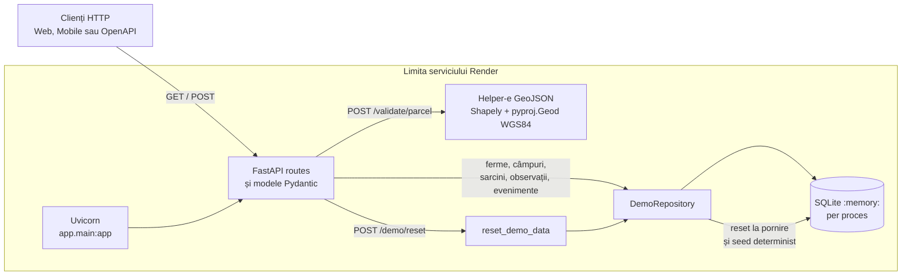

# Arhitectura runtime

Acest document descrie implementarea care rulează în repository, nu o arhitectură
de producție propusă. API-ul deservește exclusiv un demo cu date sintetice.

## Fluxul unei cereri

La intrare, Uvicorn încarcă obiectul `app` din
[`app/main.py`](../app/main.py). FastAPI aplică modelele Pydantic pentru corpuri și
răspunsuri, iar `HTTPException` și validarea Pydantic produc erorile HTTP. Middleware-ul
`CORSMiddleware` permite numai originile configurate explicit prin
`FARM_REGISTRY_CORS_ORIGINS` sau lista locală implicită; wildcard-ul este eliminat.

Rutele de registru și activitate apelează instanța `demo_repository`. Implementarea
[`DemoRepository`](../app/repository.py) creează o conexiune
`sqlite3.connect(":memory:", check_same_thread=False)` și serializează accesul în
proces cu `threading.Lock`. Baza aparține procesului curent: nu este un fișier, nu este
partajată între procese și dispare la restart sau redeploy.

## Validarea GeoJSON

`POST /validate/parcel` primește `GeoJSONPayload`, acceptă `Feature`, `Polygon` sau
`MultiPolygon`, extrage geometria și verifică structura coordonatelor, valorile finite și
intervalele longitudine/latitudine. Shapely construiește și validează topologia, iar
`pyproj.Geod(ellps="WGS84")` calculează aria geodezică; găurile sunt scăzute și părțile
unui `MultiPolygon` sunt însumate.

În starea auditată, ruta și helper-ele `_geometry_from_payload`,
`_validate_coordinate_ranges`, `_polygon_area_m2` și `_geodesic_area_m2` sunt toate în
[`app/main.py`](../app/main.py). Un modul `app/geo.py` nu există în arborele curent, deci
nu este prezentat ca evidence path. Separarea într-un asemenea modul ar fi o schimbare
de cod, în afara acestei actualizări docs-only.

## Seed și reset

Constructorul `DemoRepository.__init__` creează schema și apelează `reset()`. Acesta
șterge tabelele în ordine sigură și rulează seed-urile deterministe pentru ferme,
câmpuri, sarcini, observații și evenimente. `POST /demo/reset` apelează același flux prin
`reset_demo_data()` și întoarce numărul de rânduri restaurate.

Resetarea afectează numai baza procesului care a primit cererea. Scrierile create prin
`POST /tasks` și `POST /observations` nu sunt persistente; lock-ul protejează accesul în
același proces, nu oferă coordonare distribuită.

## Limita Render

[`render.yaml`](../render.yaml) declară serviciul web `farm-registry-api-demo`, instalează
pachetul, pornește `uvicorn app.main:app` pe portul oferit de platformă, verifică
`/health` și fixează Python 3.12. Instanța publică este
[farm-registry-api-demo.onrender.com](https://farm-registry-api-demo.onrender.com).

Render găzduiește procesul, dar nu schimbă modelul de date: SQLite rămâne în memorie și
poate fi pierdut la restart, redeploy sau înlocuirea procesului. Configurația nu adaugă
autentificare, stocare persistentă ori integrare cu servicii externe.

## Frontiera de încredere

Tot conținutul seed-uit este sintetic și folosește identificatori `SYN-`. API-ul nu
implementează autentificare sau autorizare și nu este conectat la cadastru, GPS real,
MPass ori MConnect. Modelele Pydantic, verificările relațiilor și validarea GeoJSON sunt
validări de contract pentru demo, nu controale suficiente pentru un registru de
producție.

Maparea verificabilă între operații, simboluri și teste se află în
[matricea de evidence](evidence-matrix.md).
